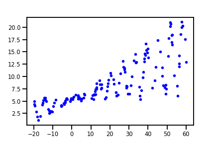

The examples displayed here are taken from [Kevin Murphy](https://twitter.com/sirbayes)'s probabilistic machine learning [Colab notebook](https://code.probml.ai/book1/2.14).

Linear regression is a basic curve fitting technique using a straight line model to approximate the data trend. However, when the data is noisy, scientists need to understand the assumptions and quantify the reliability of their curve fitting methods. A probabilistic approach to modeling enables the quantification of uncertainty, and I recently encountered an interesting implementation of probabilistic regression that's worth explaining for `TensorFlow` beginners. We will first look at linear regression in it's simplest form, and then create a `Sequential` model for the probabilistic approach.

<p align="center">

<figcaption style="font-size:65%">xkcd.com/1725/</figcaption>
</p>

## The Data

The 150 data points used here are synthesized with linear trend specified by `w = 0.125` and `b=5.0`, or slope and intercept, respectively. We used `numpy`'s `rand` function to introduce some randomness in both the dependent and independent variables. The data is displayed below, a `1+sin(x) + noise` scaling was used for the dependent variable `y` to create the dispersing noise effect.

<p align="center">

<figcaption align="center" style="font-size:65%"> Synthetic data with increasing noise, created with code from the colab notebook linked above.</figcaption>
</p>

## Ordinary least squares linear regression

The most basic form of linear regression uses ordinary least squares, which aims to minimize the sum of squares between the observed data points and the predictions from the linear model.

This approach is implemented by `scikit-learn`'s `LinearRegression` module. And we can easily apply it to our data with the following:

```python
from sklearn.linear_model import LinearRegression

reg = LinearRegression().fit(x, y) 
reg_line = x_tst * reg.coef_ + reg.intercept_ # linear model

# plot
plt.figure()
plt.plot(x, y, "b.", label="observed")
plt.plot(x_tst, reg_line, "r", label='OLS', linewidth=4)
```

<p align="center">

<figcaption align="center" style="font-size:65%"> Linear regression using ordinary least squares.</figcaption>
</p>


The `fit()` method will find the weights `w` and intercept `b` for the linear approximation $w\pmb{x} + b$ that minimizes the squared sum error. With `LinearRegression`, we can call the `score()` method to obtain a $R^2$ coefficient of determination. In this case, we obtained $\hat{w} = 0.16$ and $\hat{b} = 5.44$ with a $R^2$ coefficient of $0.66$. 